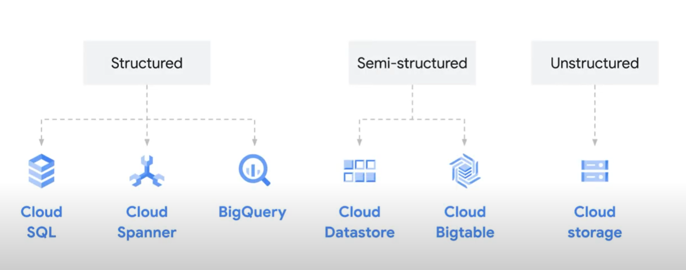

# Module 2: Data Consolidation and Analytics

### Introduction
- We can migrate the data to the cloud
- Understanding the meaning of database, datawarehouse, data lakes
- Cloud bussiness solution

## Migrating Data to Cloud
- Most organization stored the data on premised or on individual computer
- Vulnurable to users attack
- On cloud we can easyly access data and keep scure from threats
- How data is stored is critical for business success
- Cloud provide greater return on investment

**On Premis** | **Cloud**
--- | ---
Resposible for IT infrastrucutre maintain | No needed
Security | No needed
Processing data | No needed
Infrastructure capacity | Elastic scalling
More time consuming | Less time needed
Expensive | Rent as needed
Difficult to scale easily | Easy scalling

## Data Store

### Database
- Organized collection of data
- Generally stored in tables
- Accessed electronically from computer system
- Databases business priority: Data integrity and Scale
- Google cloud database services:
  - Cloud SQL: RDBMS
  - Cloud spanner: coppied across region

### Datawarehous
- Enable for rapid analysis of large and multidimentional datasets
- Central hub for all business data
- Structured and semistructured
- Data warehouse transform unstructure to semi-structure
- Google big query

### Data Lakes
- Store unstructure data
- Stored in native format
- Using Google cloud storage
- Benefits:
  - Store unlimited data
  - Low latency
  - Access anywhere

### Google Cloud Tools

## Business Solution
- Business challenge is identifying the right business intelligence solution
- Some solution is complex, not accessible for everyone outside data engineering or data analysis teams
- The solution is let everyone in business perform their own data analysis
- Google cloud tools looker is the one of solution
- Looker: describe the data, define the business metrics
- So everyone in business can analyze, explore, ask and answer question, create visualization, and explore the details of data
- 
