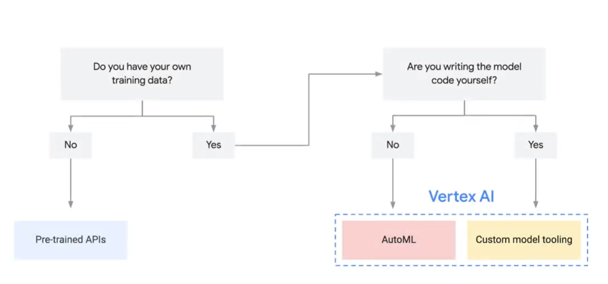

# Module 3: Innovation with Machine Learning
### Introduction
- Volumes of data and the right cloud-bassed tools are foundation for using machine learning (ML) and artificial intelligence (AI)
- Consider data quality that infuence the efficiency of ML models
- Leverage ML to transform the business

## What is Machine Learning 
- Most data analysis is probably backward-looking (descriptive) like historical data to calculate metrics or identify trends
- You need to use that data to make a decision for future business or make a decision
- Machine learning is a part of Artificial intelligence
- Artificial intelligence is A broad field or term that describes any kind of machine capable of a task that normally requires human intelligence, such as visual perception, speech recognition, decision-making, or translation between languages.
- ML refers to computers that can "learn” from data and make predictions or decisions without being explicitly programmed to do so. This is done using algorithms or models to analyze data. These algorithms use historical data as input to predict new output values.
- ML is a way to use standard algorithms to analyze data in order to derive predictive insight and make repeated decision at scale.
- Needs a lot of high-quality data to train ML model effectively to generate more and more acurate meaningful predictions

## Data Quality
- Coverage
- Complete
- Clean

### Coverage
The scope of a problem domain and all possible scenarios it can account for. Which mean all possible input and output data

### Cleanliness or Consistency
Data is considered "dirty" or "inconsisten" if it includes or exclude anything that might prevent an ML model from making accurate predictions. Example: data format

### Completeness
Refers to the availability of sufficient data about the world to replace human knowledge.

## Google Cloud ML Solution
- No need robust technical team to leverage the capabilities of cloud in ML
- Google cloud democratizes AI by providing a range of tools to support an entire machine learning workflow across different model types in varying level of ML expertise
- Flowchart to help identify the best approach for your machine learning projects

- 
